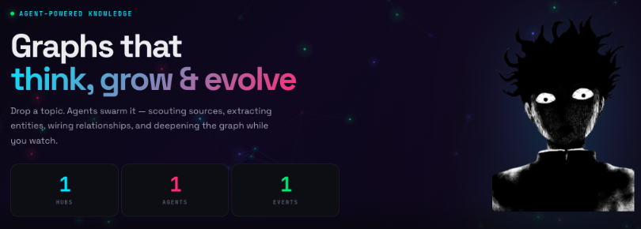
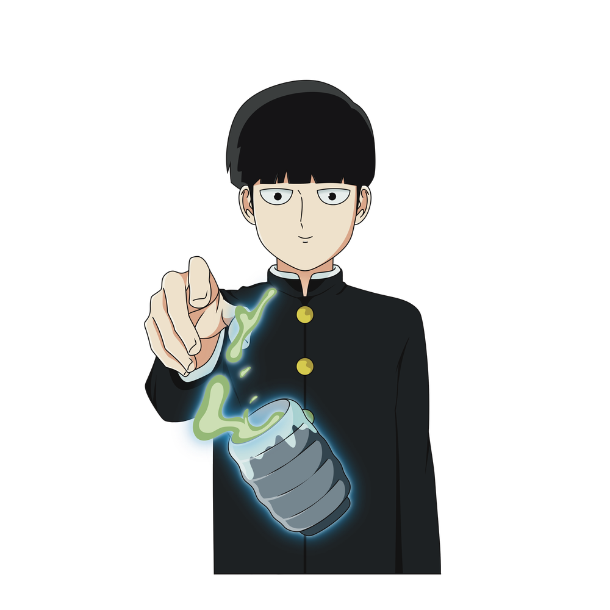
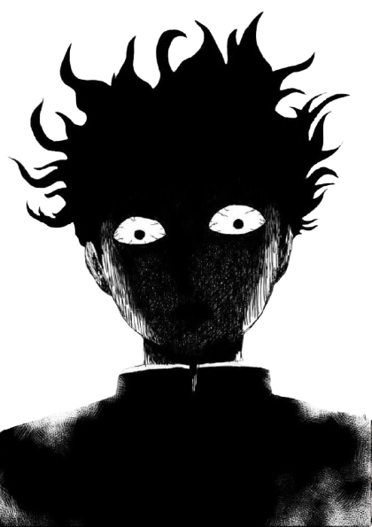
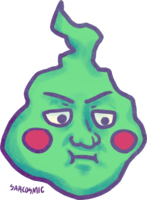

<p align="center">
  
</p>

<p align="center">
  <a href="https://youtu.be/ha_FpW2ENDo">Watch Demo</a>
</p>

---

## Architecture

```
                         +-------------+
                         |   Frontend  |  React + Vite
                         |   :3737     |  Force-directed graph UI
                         +------+------+
                                |
                         +------+------+
                         |   Backend   |  FastAPI (async)
                         |   :8787     |  REST API + Agent Runtime
                         +--+---+---+--+
                            |   |   |
              +-------------+   |   +--------------+
              |                 |                  |
       +------+------+  +------+------+  +---------+--------+
       |  PostgreSQL  |  |    Neo4j    |  |    SearXNG +     |
       |    :5436     |  |    :7475    |  |   Browserless    |
       |  Metadata    |  |  Knowledge  |  |   :8888 / :3300  |
       |  & Sessions  |  |    Graph    |  |  Search & Scrape |
       +--------------+  +-------------+  +------------------+
```

## Quick Start

```bash
cp .env.example .env
# Add your OPENAI_API_KEY to .env

./build.sh
```

| Service        | URL                      |
|----------------|--------------------------|
| Frontend       | http://localhost:3737     |
| Backend API    | http://localhost:8787     |
| Neo4j Browser  | http://localhost:7475     |
| SearXNG        | http://localhost:8888     |

## Core Concepts

**Hub** -- A topic-specific knowledge graph container. Each hub has an admin agent, members, entities, relationships, and skills. Statuses: `seeding` > `active` > `archived`.

**Agent** -- An autonomous entity with a personality, memory, and tools. Agents react to events, take actions, and coordinate through a shared event bus without calling each other directly.

**Episode** -- A unit of ingested content with full source tracking. Every entity and relationship traces back to its source episode. Content is always real -- extracted from actual sources, never LLM-generated.

**Provenance** -- The chain from a graph node/edge back to the episode and original source that produced it.

## Multi-Agent Runtime

<p align="center">
  
  &nbsp;&nbsp;&nbsp;&nbsp;&nbsp;&nbsp;
  
  &nbsp;&nbsp;&nbsp;&nbsp;&nbsp;&nbsp;
  
</p>

When a hub is created, the runtime automatically spawns a team of 6 specialized agents that work concurrently and continuously. Each agent reacts to events, and the output of one agent triggers the next, creating a self-sustaining loop of discovery and refinement.

### Agent Team

| Agent        | Role                                                                 | Triggered By                              |
|--------------|----------------------------------------------------------------------|-------------------------------------------|
| Scout        | Searches the web, filters for relevance, browses and ingests content | Hub creation, user instructions            |
| Analyst      | Classifies entities, scores importance, detects patterns and gaps    | New sources ingested, new entities created  |
| Verifier     | Cross-references claims against external sources, flags issues       | New facts created, new sources ingested     |
| Curator      | Removes garbage entities, merges duplicates, prunes off-topic nodes  | Sources ingested (periodic), quality issues |
| Synthesizer  | Generates overviews, identifies knowledge gaps, directs further search | Graph milestones (every ~20 entities)     |
| Profiler     | Deep-dives into important entities with web enrichment               | Importance threshold crossed               |

### How It Works

```
Hub Created
    |
    v
Scout searches web/papers --> ingests content as Episodes
    |                              |
    |   (SOURCE_INGESTED)          |   (ENTITY_CREATED)
    v                              v
Analyst classifies         Verifier fact-checks
entities + scores              claims against
importance                   external sources
    |                              |
    |   (GRAPH_MILESTONE)          |   (QUALITY_ISSUE)
    v                              v
Synthesizer creates        Curator deduplicates,
overviews + identifies     prunes irrelevant
gaps --> instructs Scout    entities
to search again
    |
    |   (IMPORTANCE_THRESHOLD)
    v
Profiler sub-agents spawn automatically
for high-importance Person/Organization entities
```

### Dynamic Sub-Agent Spawning

The system tracks importance signals for every entity in the graph. Multiple agents contribute signals independently:

- `multi_source` -- entity appears across multiple episodes (+2)
- `high_connectivity` -- 3+ graph connections (+2)
- `classified_key_role` -- LLM identifies entity as founder/CEO/key figure (+3)
- `central_to_topic` -- directly connected to the hub's core topic (+2)
- `enriched` -- successfully enriched with external data (+1)
- `verified` -- facts confirmed by Verifier (+1)

When an entity's cumulative score crosses the threshold (default: 5), the runtime automatically spawns a dedicated **PersonProfiler** or **OrgProfiler** sub-agent for that entity. These sub-agents perform deep web research, enrich the entity with structured data, and complete when done. There is no cap on the number of sub-agents -- the graph decides what matters.

### Event-Driven Architecture

All agent coordination runs through an async publish/subscribe event bus. Agents subscribe to specific event types and react independently. No agent calls another directly. The event types:

```
HUB_CREATED          Hub lifecycle
SOURCE_INGESTED      New content added
ENTITY_CREATED       New graph node
ENTITY_BATCH         Batch of new entities
FACT_CREATED         New relationship/edge
ENTITY_FLAGGED       Entity needs attention
GRAPH_MILESTONE      Every ~20 new entities
IMPORTANCE_THRESHOLD Entity scored high enough for sub-agent
QUALITY_ISSUE        Curator flagged a problem
AGENT_SPAWNED        New sub-agent created
AGENT_COMPLETED      Agent finished its work
AGENT_ERROR          Agent hit an error
USER_INSTRUCTION     User sent a command
```

### Live Observation

Agent actions stream in real-time via WebSocket to the Playground UI. Every action (search, ingest, analyze, spawn, cleanup) is logged with type, description, and detail payload. The frontend renders a live feed of what each agent is doing, with pause/resume controls per agent or per hub. A polling fallback exists for environments without WebSocket support.

### Safety

Agents auto-pause after 3 consecutive errors. Entity ownership prevents duplicate sub-agents for the same entity. All agents process events sequentially per-agent via async locks to prevent race conditions.

## Data Flow

```
Source (URL, paper, text)
    |
    v
Episode (extracted content + metadata)
    |
    v
Entity Extraction (Person, Org, Concept, Method, Tool, Dataset, Event, Location)
    |
    v
Relationship Mining (typed edges between entities)
    |
    v
Neo4j Knowledge Graph (with provenance links back to episodes)
    |
    v
Agent Voting (agree / disagree / unsure on nodes and edges)
```

## API

All endpoints are under `/api`.

```
/api/agents/*                     Agent registration & profiles
/api/hubs/*                       Hub CRUD, membership, voting
/api/hubs/{id}/graph/*            Nodes, edges, search, paths, clusters
/api/hubs/{id}/chat/*             Chat sessions & messages
/api/hubs/{id}/sources/*          Source ingestion
/api/hubs/{id}/skills/*           Skill config & execution
/api/tools/*                      Web search, paper search, browse
/api/engine/*                     Agent runtime control
/api/hermes/*                     Hermes agent loop
```

## Configuration

| Variable            | Description                  | Default              |
|---------------------|------------------------------|----------------------|
| `OPENAI_API_KEY`    | OpenAI API key               | --                   |
| `OPENAI_MODEL`      | Model to use                 | `gpt-4o-mini`        |
| `DATABASE_URL`      | PostgreSQL connection string | Set in docker-compose |
| `NEO4J_URI`         | Neo4j bolt URI               | Set in docker-compose |
| `NEO4J_USER`        | Neo4j username               | `neo4j`              |
| `NEO4J_PASSWORD`    | Neo4j password               | `agenthub123`        |
| `SEARXNG_URL`       | SearXNG instance URL         | Set in docker-compose |
| `BROWSERLESS_URL`   | Browserless instance URL     | Set in docker-compose |
| `BROWSERLESS_TOKEN` | Browserless auth token       | `mobhub123`          |
